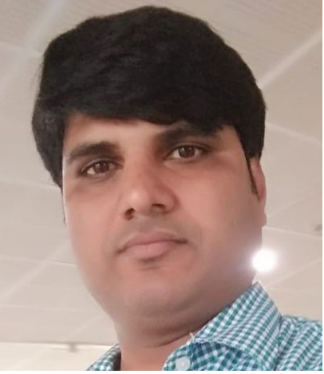

### Digital Fabrication Lab at STPI Bhuwneswar 
Saurabh Kumar Tiwari Technical Officer STPI Gurugram

- Date : 18.03.2019 Time 10:00AM
- Mentor Mr Fransisco from Barcelona Spain and Mr Shibu from kochi Kerala

The digital fabrication lab program is organised by the STPI bhuwneswar for the period of 18 march 2019 to 05th april 2019. Participant of this program are member of technical staff of STPI center acros the india. 

The object of this Fab lab training is to make "almost anything". While the fab labs yet to compete with mass production product where as the fab labs have the potential to empower individuals to create smart device for themselves.   

It may be possible that STPI will setup new fab lab across the india for innovators, inventors, students, artist, to learn and create a new product.