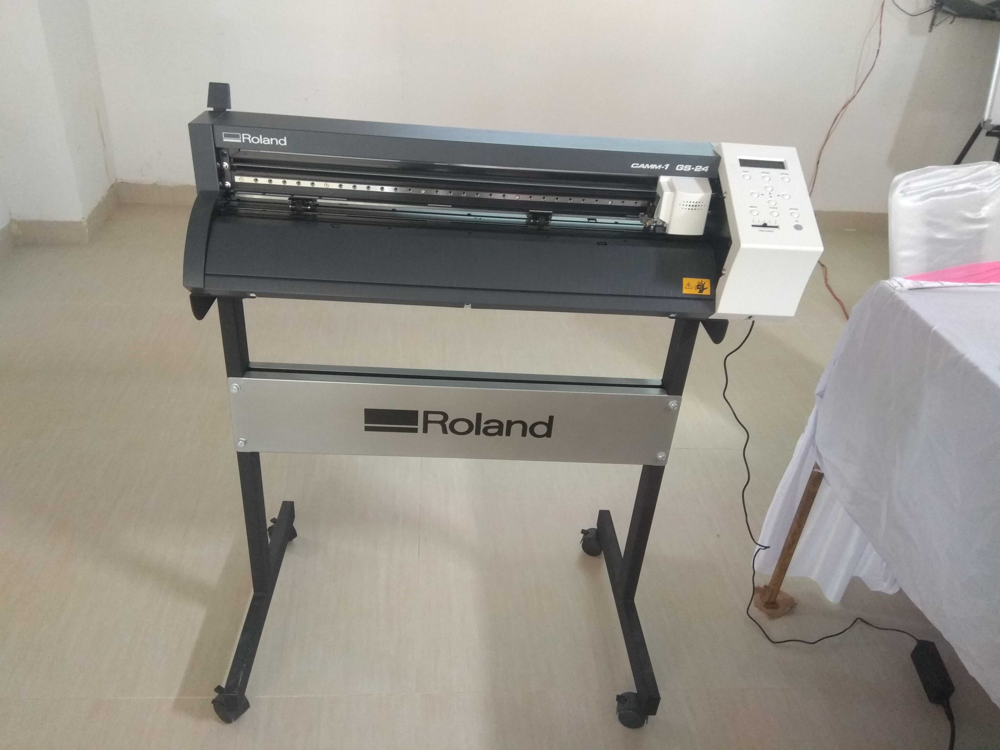
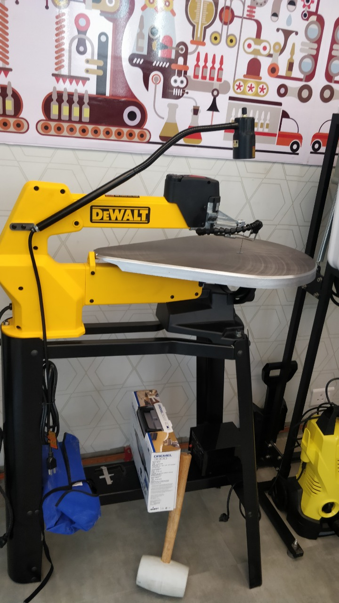
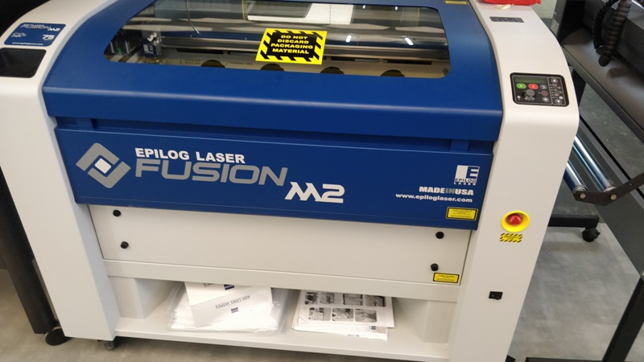
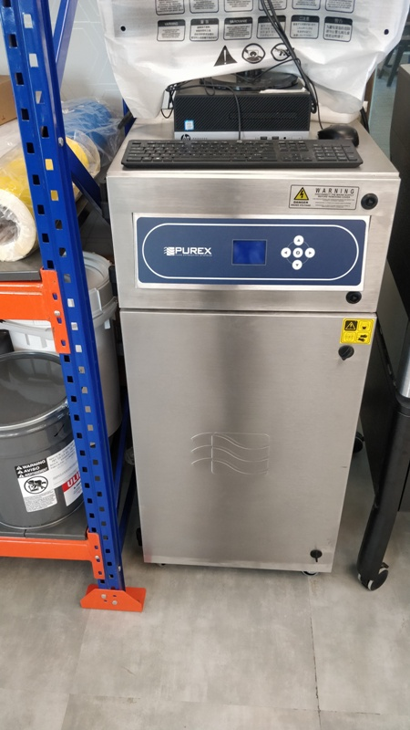

# Saurabh Kumar Tiwari STPI Gurugram

- Date : 18.03.2019 Time 10:00AM
- Trainer Mr Fransisco from Spain and Mr Shibu from Kerala

## MY First Day At Digital Fabrication lab Training center Bhubneswar
### A brief Introduction about the digital fabrication lab given by the trainer and visit the lab . There are so many CNC machines and tools are available in the lab. A brief introduction about the CNC machines and tools given by the trainer.
End of the Day 1

# Day 2 # Upload image

# vinaylcutter

 # 3dprinter

# bandsaw1

# bandsaw2

# inkjetprinter

# lasercutter

# laserfilter

# stereolythographyprinter

## Download inkscape software:
### Inkscape is quality vector graphics software which runs on Windows, Mac OS and Linux operating system. It is used to design a wide variety of graphics such as icons, logos, diagrams. Inkscape uses the W3C open standard SVG (Scalable Vector Graphics)  and is free and open-source software.

## Download cura software
### Cura is used for 3D printing. Cura creates a seamless integration between your 3D printer, software and materials to achieve perfect prints every time. 3 steps to printing a 3D model design prepare and print.