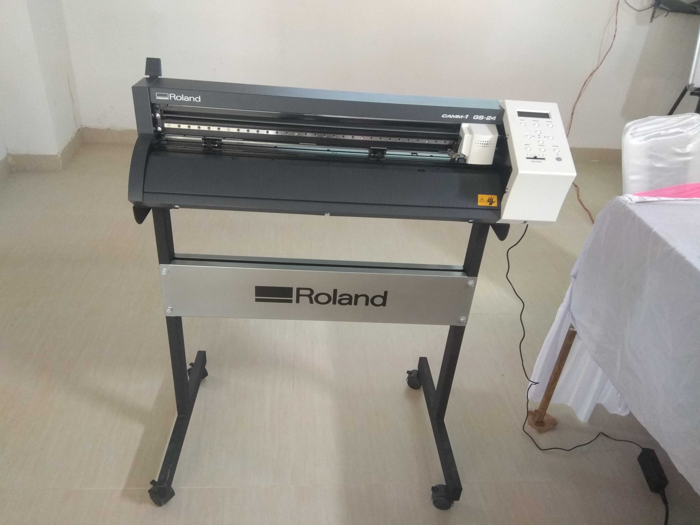
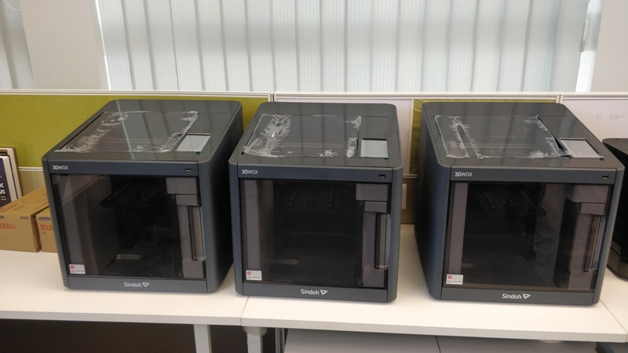
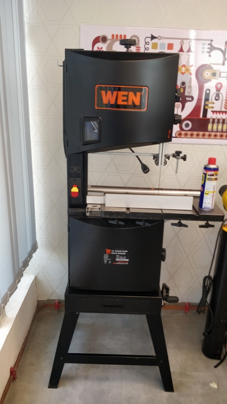
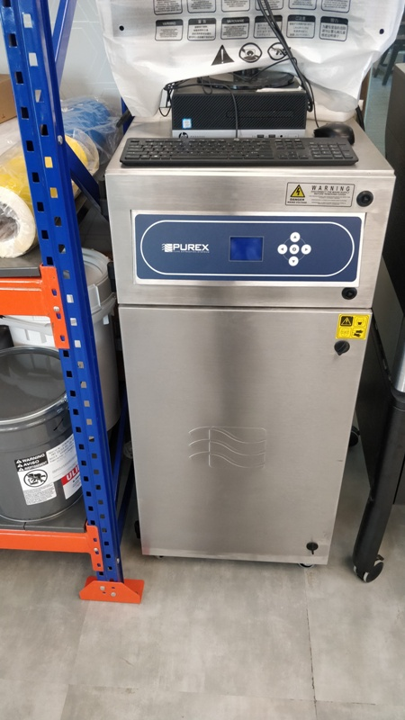

 1. Introduction about digital fabrication lab
2. How Does Digital Fabrication Work?

    A. Design
    
    B. Prepare
    
    C. Fabricate
3. Digital Fabrication Tools: 
    
    A. 3D Printers
    
    B. Stereolithography (SLA)
    
    C. Vinyl Cutter
    
    D. 

4. Design Tools
    
    A. Inkscape
    
    B. 3D WOX Desktop
    
    C. KiCAD    

# Saurabh Kumar Tiwari STPI Gurugram

- Date : 18.03.2019 Time 10:00AM
- Trainer Mr Fransisco from Spain and Mr Shibu from Kerala

A brief Introduction about the digital fabrication lab given by the trainer and visit the lab . There are so many CNC machines and tools are available in the lab. A brief introduction about the CNC machines and tools given by the trainer.

# Day 2 # Upload image

# Vinyl Cutter:

A vinyl cutter is a machine controlled by the computer. It is look like a just desktop computer. The movement of the sharp blade over the surface of the material is control by the computer.   

 # 3D Printer:

# Bandsaw type 1

# Bandsaw Type 2

# Inkjet Printer:

# Laser Cutter

# Laser Filter

# Stereolithography Printer:

## Download inkscape software:
### Inkscape is quality vector graphics software which runs on Windows, Mac OS and Linux operating system. It is used to design a wide variety of graphics such as icons, logos, diagrams. Inkscape uses the W3C open standard SVG (Scalable Vector Graphics)  and is free and open-source software.

## Download cura software
### Cura is used for 3D printing. Cura creates a seamless integration between your 3D printer, software and materials to achieve perfect prints every time. 3 steps to printing a 3D model design prepare and print.

# Introduction:

Society faces enormous challenges in constructing a high-quality, future-oriented built environment. Current research on digital fabrication in architecture indicates that the development and integration of innovative digital technologies within architectural and construction processes could transform the building industry - on the verge of a building industry 4.0. Digital technologies in architecture and construction could increase productivity and create new jobs.

Digital fabrication is a design and manufacturing workflow where digital data directly drives manufacturing equipment to form various part geometries. This data most often comes from CAD (computer-aided design), which is then transferred to CAM (computer-aided manufacturing) software. The output of CAM software is data that directs a specific machine, like a 3D printer or CNC milling machine.

A wide variety of digital fabrication tools exist, from hobbyist-level machines to large-scale, specialized industrial equipment used in manufacturing. This guide focuses on the most common tools suitable for professional workspaces, machine shops, and workshops

Accessible digital fabrication tools bridge the gap between design and manufacturing. As barriers to professional-level tech lowers, it’s easier for anyone with the skills to design a product to also fabricate it, empowering engineers, product designers, and businesses of all sizes to produce anything from prototypes to final products.

# How Does Digital Fabrication Work?

## 1. Design:

The first step is to create a virtual model of a design using CAD software. To serve as input for the fabrication tool, the 3D model is exported as a triangulated mesh, which uniformly describes the geometry in terms of points on the surface or vertices, the faces between those vertices, the edges of those faces, and in some cases, the normal vectors and color information pertaining to the faces.

## 2. Prepare:

Print preparation software or slicer software serves as the intermediate between the virtual mesh and the fabricated model for 3D printing. In this step, manufacturing parameters and settings specific to the fabrication tool are added to provide essentially a list of instructions for the machine to follow, resulting in a CAM file that’s sent to the machine. In machining operations, software simulation is combined with user input to generate toolpaths that will guide the cutting tool through the part geometry, taking into account speed of the cutting tool and feed rate of the material.

## 3. Fabricate:

Fabrication tools manufacture parts based on the CAM data, with little or no human assistance or interaction. The fabricated parts might require some form of finishing to achieve their final properties and look before they’re ready to use. 

# Digital Fabrication Tools:

## 3D Printers:

3D printing or additive manufacturing (AM) technologies create parts by successively adding material layer by layer until a physical part is created.

## Fused deposition modeling (FDM):

Fused deposition modeling (FDM) 3D printers melt and extrude thermoplastic filament, which a print nozzle then deposits layer by layer in the build area. FDM is the most affordable 3D printing technology with entry-level hobbyist machines starting below $1,000, and mid-range machines selling for $2,500. FDM parts have the lowest resolution and accuracy compared to other plastic 3D printers, making these machines a better fit for basic proof-of-concept models and quick, low-cost prototyping of simple parts than for refined prototypes or final products.

## Stereolithography (SLA):

Stereolithography (SLA) uses a laser to cure liquid resin into hardened plastic in a process called photopolymerization. SLA parts are highly accurate, have fine details, smooth surface finish, and isotropic material properties. SLA 3D printing is ideal for complex designs, functional prototypes, manufacturing tooling, and casting patterns. Starting around $3,500, desktop SLA printers are highly versatile tools that are easy to use and accessible to professional users.

