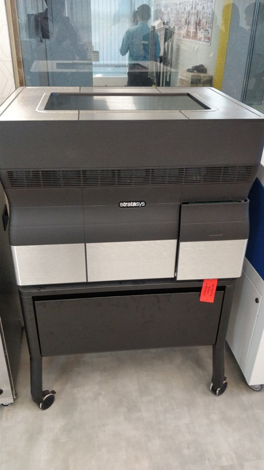

# Saurabh Kumar Tiwari STPI Gurugram

- Date : 18.03.2019 Time 10:00AM
- Trainer Mr Fransisco from Spain and Mr Shibu from Kerala

## MY First Day At Digital Fabrication lab Training center Bhubneswar
### A brief Introduction about the digital fabrication lab given by the trainer and visit the lab . There are so many CNC machines and tools are available in the lab. A brief introduction about the CNC machines and tools given by the trainer.
End of the Day 1

# Day 2 # Upload image

# vinaylcutter

 # 3dprinter

# bandsaw1

# bandsaw2

# inkjetprinter

# lasercutter

# laserfilter

# stereolythographyprinter

## Download inkscape software:
### Inkscape is quality vector graphics software which runs on Windows, Mac OS and Linux operating system. It is used to design a wide variety of graphics such as icons, logos, diagrams. Inkscape uses the W3C open standard SVG (Scalable Vector Graphics)  and is free and open-source software.

## Download cura software
### Cura is used for 3D printing. Cura creates a seamless integration between your 3D printer, software and materials to achieve perfect prints every time. 3 steps to printing a 3D model design prepare and print.
# Society faces enormous challenges in constructing a high-quality, future-oriented built environment. Construction sites today, still look much like building sites at the beginning of the 20th century. Current research on digital fabrication in architecture indicates that the development and integration of innovative digital technologies within architectural and construction processes could transform the building industry - on the verge of a building industry 4.0. Digital technologies in architecture and construction could increase productivity and create new jobs.